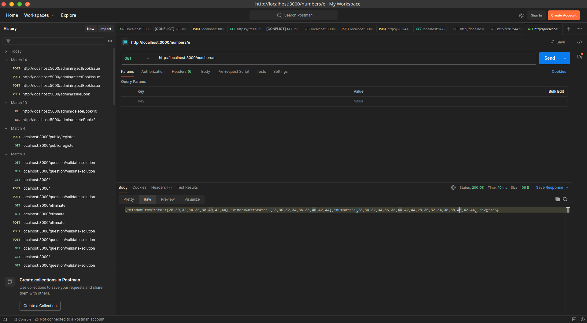
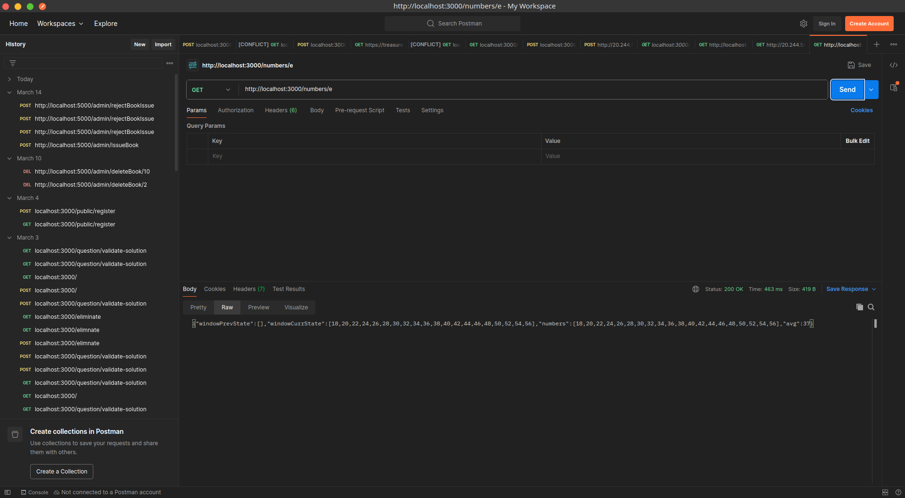

# Number Management API

This is a RESTful API built with Express.js for managing numbers and their operations.

## Features

- Express.js server with RESTful endpoints
- Error handling middleware
- JSON and URL-encoded body parsing
- Modular route structure

## Project Structure

```
├── src/
│   └── routes/
│       └── numberRoutes.js
├── asset/
│   ├── Screenshot_20250328_153058.png
│   └── Screenshot_20250328_152907.png
├── index.js
├── package.json
└── .env
```

## Screenshots

### API Response Example 1


### API Response Example 2


## Setup and Installation

1. Clone the repository
2. Install dependencies:
   ```bash
   npm install
   ```
3. Create a `.env` file with your configuration
4. Start the server:
   ```bash
   npm start
   ```

## API Endpoints

The API is available at `http://localhost:3000` (or your configured PORT)

### Numbers Routes
- Number endpoint is  `/numbers`

## Error Handling

The API includes global error handling middleware that returns appropriate error responses in JSON format.


